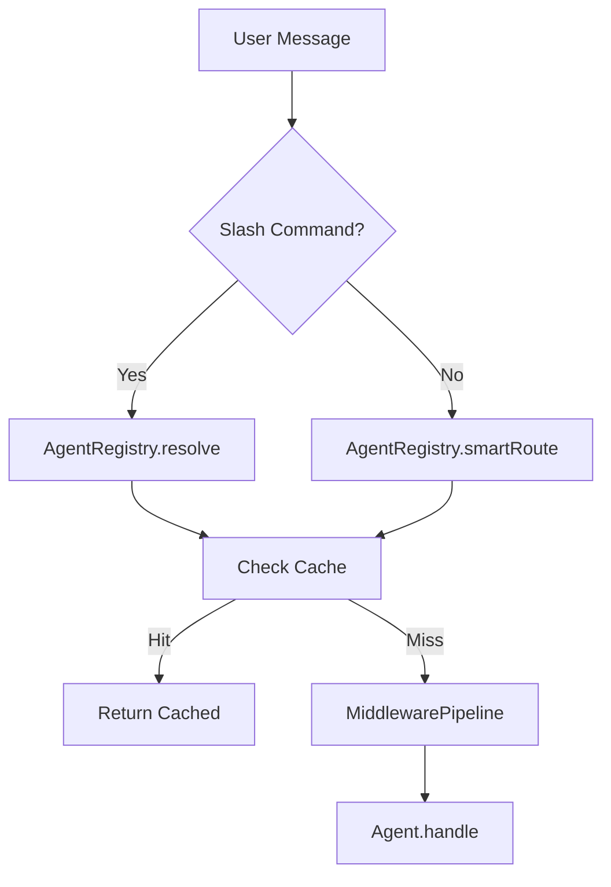

# Generate Documentation

Create or update documentation for the VS Code Agent extension.

## Documentation Types

### 1. JSDoc (English)
```typescript
/**
 * Register a new agent in the registry.
 * The first registered agent becomes the default.
 *
 * @param agent - The agent instance to register
 * @throws If agent ID conflicts with an existing registration
 */
register(agent: BaseAgent): void { ... }
```

### 2. README Sections (Swedish)
Follow the existing README format with emoji headers:
```markdown
## ✨ Features
| Feature | Beskrivning |
|---|---|
```

### 3. Architecture Diagrams (Mermaid)


### 4. Settings Reference Table
```markdown
| Setting | Default | Beskrivning |
|---|---|---|
| `vscodeAgent.locale` | `auto` | Språk: auto, en, sv |
```

## What to Document

- New agents: add to agent table in README
- New commands: add to command list in README
- New settings: add to settings table in README
- New tests: add to test table in README
- Architecture changes: update the flow diagram
- API changes: update JSDoc and copilot-instructions.md

## Rules

- README in Swedish, JSDoc in English
- All code examples must be real, working code
- Keep README tables sorted alphabetically
- Use Mermaid for diagrams — they render on GitHub
