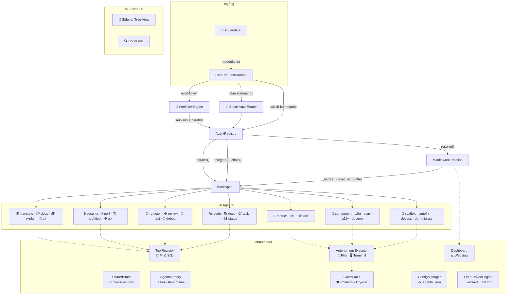
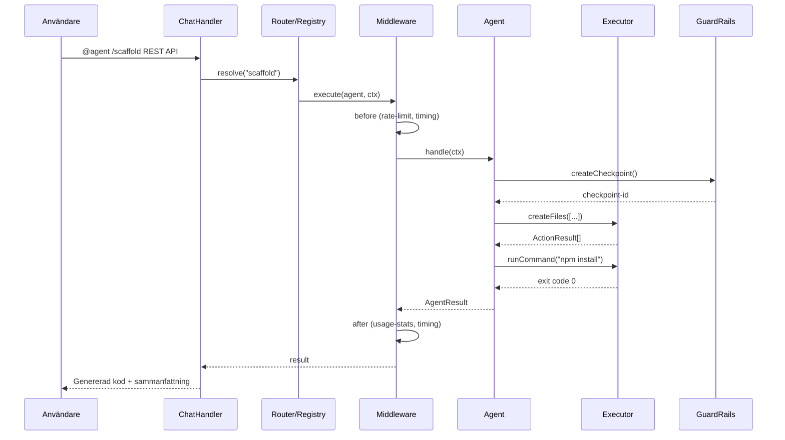

# 🤖 VS Code Agent

En modulär, utbyggbar agent-struktur för VS Code Chat med **26 specialiserade AI-agenter**, autonoma filändringar, cross-window-synkronisering och en komplett utvecklingsplattform.

**61 filer · 6 470 rader TypeScript · 26 agenter · 3 workflows · 12 moduler**

---

## ✨ Features

| Feature | Beskrivning |
|---|---|
| **26 agenter** | Allt från kodgenerering till fullstack-scaffolding |
| **Smart Auto-Router** | LLM väljer automatiskt rätt agent — ingen slash-command behövs |
| **Agentkedjor** | Agenter kan delegera till varandra och köra i sekvens |
| **Parallell exekvering** | Kör flera agenter samtidigt |
| **Workflow Engine** | Multi-agent-pipelines med villkor, retry och parallella grupper |
| **Autonoma agenter** | Skapar, redigerar och tar bort filer + kör terminalkommandon |
| **Guard Rails** | Checkpoints, rollback/undo, dry-run och bekräftelsedialoger |
| **Persistent minne** | Agenter minns fakta och beslut mellan sessioner |
| **Event-driven** | Trigga agenter automatiskt vid save, fel, nya filer, intervall |
| **Middleware** | Timing, usage-tracking, rate-limiting hooks |
| **Webview Dashboard** | Realtidsstatistik, aktivitetslogg, topplista |
| **Sidebar Tree View** | Alla agenter i sidopanelen med ikoner och användningsdata |
| **CodeLens** | Inline-knappar "Dokumentera", "Fixa TODO", "Refaktorera", "Testa" |
| **Projektconfig** | `.agentrc.json` per projekt — custom prompts, workflows, regler |
| **Cross-window sync** | Delat tillstånd mellan VS Code-fönster |

---

## 🚀 Kom igång

### Förutsättningar

- [VS Code](https://code.visualstudio.com/) ≥ 1.93.0
- [Node.js](https://nodejs.org/) ≥ 18
- GitHub Copilot Chat (eller annan Chat Participant-kompatibel extension)

### Installation

```bash
# Klona repot
git clone https://github.com/ashsolei/vscode-agent.git
cd vscode-agent

# Installera beroenden
npm install

# Kompilera
npm run compile
```

### Starta i debug-läge

1. Öppna projektet i VS Code:
   ```bash
   code .
   ```
2. Tryck **F5** (eller **Run → Start Debugging**)
3. Ett nytt VS Code-fönster öppnas — extensionen är aktiv där

### Använda agenterna

Öppna **Chat-panelen** (⌘⇧I / Ctrl+Shift+I) i debug-fönstret.

#### Med slash-kommando (direkt routing)

```
@agent /code skriv en sorteringsfunktion i TypeScript
@agent /test generera enhetstester för UserService
@agent /refactor bryt ut denna funktion
@agent /scaffold en Express REST-API med auth
@agent /autofix fixa alla TypeScript-fel
@agent /fullstack skapa en todo-app med React + Express + SQLite
```

#### Utan slash-kommando (smart auto-routing)

```
@agent hur refaktorerar jag den här filen?
@agent finns det säkerhetsproblem i min kod?
@agent skapa en React-komponent för en datatabell
```

Smart Auto-Router (LLM-baserad) analyserar meddelandet och väljer automatiskt rätt agent.

#### Workflows (multi-agent-pipelines)

```
@agent /workflow-quality          # review → test → security + perf
@agent /workflow-ship login-sida  # plan → scaffold → code → test → docs → review
@agent /workflow-fix              # autofix → test → security
```

### Sidopanelen

Klicka på **🤖-ikonen** i Activity Bar. Alla 26 agenter visas grupperade med ikoner och användningsstatistik. Klicka för att starta.

### CodeLens

Öppna valfri `.ts`/`.js`/`.py`-fil. Inline-knappar visas automatiskt:
- **📝 Dokumentera** — funktioner utan JSDoc
- **🤖 Fixa TODO** — TODO/FIXME/HACK-kommentarer
- **⚡ Refaktorera (X rader)** — funktioner > 50 rader
- **🧪 Generera tester** — exporterade klasser

### Kommandon (⌘⇧P)

| Kommando | Beskrivning |
|---|---|
| `Agent: Visa Dashboard` | Öppna webview med realtidsstatistik |
| `Agent: Ångra senaste agent-ändring` | Rollback till senaste checkpoint |
| `Agent: Skapa .agentrc.json` | Skapa projektconfig |
| `Agent: Visa minnesstatistik` | Se agenternas persistenta minne |
| `Agent: Rensa agentminne` | Radera alla minnen |
| `Agent: Slå av/på CodeLens` | Toggla inline-knappar |
| `Agent: Visa delat tillstånd` | Debug cross-window state |

---

## 🏗️ Arkitektur

```
src/
├── extension.ts              # Entry point — kopplar ihop allt
├── agents/                   # 26 agenter + registry + basklass
│   ├── base-agent.ts         # Abstrakt basklass (handle, chat, delegateTo)
│   ├── index.ts              # AgentRegistry (routing, chaining, parallel, smart-router)
│   ├── code-agent.ts         # 💻 Kodgenerering
│   ├── docs-agent.ts         # 📚 Dokumentation
│   ├── task-agent.ts         # 📋 Uppgiftshantering
│   ├── status-agent.ts       # 📊 Systeminformation
│   ├── refactor-agent.ts     # 🔄 Refaktorering
│   ├── review-agent.ts       # 👁️ Kodgranskning
│   ├── test-agent.ts         # 🧪 Testgenerering
│   ├── debug-agent.ts        # 🐛 Debugging
│   ├── security-agent.ts     # 🔒 Säkerhetsanalys
│   ├── perf-agent.ts         # ⚡ Prestandaanalys
│   ├── architect-agent.ts    # 🏗️ Arkitekturdesign
│   ├── api-agent.ts          # 🌐 API-design
│   ├── translate-agent.ts    # 🌍 Kodöversättning
│   ├── dependency-agent.ts   # 📦 Beroendehantering
│   ├── explain-agent.ts      # 🎓 Kodförklaring
│   ├── git-agent.ts          # 🔀 Git-operationer
│   ├── scaffold-agent.ts     # 🤖 Projektscaffolding
│   ├── autofix-agent.ts      # 🤖 Automatisk felfix
│   ├── devops-agent.ts       # 🤖 CI/CD & DevOps
│   ├── database-agent.ts     # 🤖 Databasdesign
│   ├── migrate-agent.ts      # 🤖 Ramverksmigrering
│   ├── component-agent.ts    # 🤖 UI-komponentgenerering
│   ├── i18n-agent.ts         # 🤖 Internationalisering
│   ├── planner-agent.ts      # 🤖 Uppgiftsplanering
│   ├── a11y-agent.ts         # 🤖 Tillgänglighet
│   ├── docgen-agent.ts       # 🤖 Dokumentationsgenerering
│   ├── metrics-agent.ts      # 🤖 Kodmetriker
│   ├── cli-agent.ts          # 🤖 CLI-generering
│   └── fullstack-agent.ts    # 🤖 Fullstack-appgenerering
├── autonomous/               # AutonomousExecutor (filer, terminal, diagnostik)
├── config/                   # ConfigManager (.agentrc.json)
├── dashboard/                # Webview Dashboard (realtidsstatistik)
├── events/                   # EventDrivenEngine (onSave, onDiagnostics, etc.)
├── guardrails/               # GuardRails (checkpoints, rollback, dry-run)
├── memory/                   # AgentMemory (persistent minne mellan sessioner)
├── middleware/                # MiddlewarePipeline (timing, usage, rate-limit)
├── prompts/                  # Systemprompter
├── state/                    # SharedState (cross-window sync)
├── tools/                    # ToolRegistry (FileTool, SearchTool)
├── utils/                    # Hjälpfunktioner
├── views/                    # TreeView + CodeLens
│   ├── agent-tree.ts         # Sidebar Tree View
│   └── agent-codelens.ts     # CodeLens-integration
└── workflow/                 # WorkflowEngine (JSON-pipelines)
```

### Arkitekturdiagram



### Dataflöde



---

## ⚙️ Projektconfig (.agentrc.json)

Skapa en `.agentrc.json` i ditt projekt (eller kör `Agent: Skapa .agentrc.json`):

```json
{
  "defaultAgent": "code",
  "language": "sv",
  "autoRouter": true,
  "disabledAgents": [],
  "memory": {
    "enabled": true,
    "maxAge": 2592000000
  },
  "guardrails": {
    "confirmDestructive": true,
    "dryRunDefault": false
  },
  "prompts": {
    "code": "Du är en senior TypeScript-utvecklare. Använd strikta typer.",
    "test": "Generera tester med Vitest. Använd describe/it-mönster."
  }
}
```

---

## 🔧 Alla agenter

### Grundläggande
| Agent | Kommando | Beskrivning |
|---|---|---|
| Code | `/code` | Kodgenerering och analys |
| Docs | `/docs` | Dokumentationssökning och generering |
| Task | `/task` | Uppgiftshantering (persistent) |
| Status | `/status` | Systemstatus och konfiguration |

### Kodkvalitet
| Agent | Kommando | Beskrivning |
|---|---|---|
| Refactor | `/refactor` | Refaktorering och kodförbättring |
| Review | `/review` | Kodgranskning |
| Test | `/test` | Testgenerering |
| Debug | `/debug` | Debugging-hjälp |

### Prestanda & Säkerhet
| Agent | Kommando | Beskrivning |
|---|---|---|
| Security | `/security` | Säkerhetsanalys |
| Perf | `/perf` | Prestandaoptimering |

### Arkitektur
| Agent | Kommando | Beskrivning |
|---|---|---|
| Architect | `/architect` | Systemarkitektur |
| API | `/api` | API-design |

### Verktyg
| Agent | Kommando | Beskrivning |
|---|---|---|
| Translate | `/translate` | Kodöversättning mellan språk |
| Deps | `/deps` | Beroendehantering |
| Explain | `/explain` | Pedagogisk kodförklaring |
| Git | `/git` | Git-operationer |

### 🤖 Autonoma (gör faktiska filändringar)
| Agent | Kommando | Beskrivning |
|---|---|---|
| Scaffold | `/scaffold` | Projektscaffolding |
| AutoFix | `/autofix` | Automatisk felfix |
| DevOps | `/devops` | CI/CD-konfiguration |
| Database | `/db` | Databasschema och ORM |
| Migrate | `/migrate` | Ramverksmigrering |
| Component | `/component` | UI-komponentgenerering |
| I18n | `/i18n` | Internationalisering |
| Planner | `/plan` | Uppgiftsplanering |
| A11y | `/a11y` | Tillgänglighetsfix |
| DocGen | `/docgen` | Komplett dokumentation |
| Metrics | `/metrics` | Kodkvalitetsmetriker |
| CLI | `/cli` | CLI-verktygskapande |
| Fullstack | `/fullstack` | Komplett webapp |

---

## 📦 Publicera som VSIX

```bash
npm install -g @vscode/vsce
vsce package
# → vscode-agent-0.1.0.vsix

# Installera lokalt:
code --install-extension vscode-agent-0.1.0.vsix
```

---

## 📄 Licens

MIT
